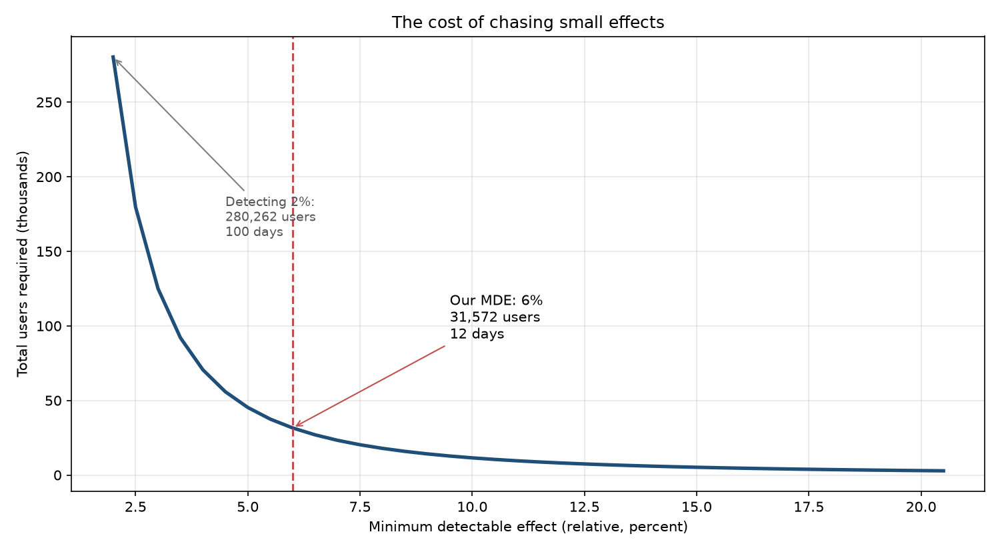
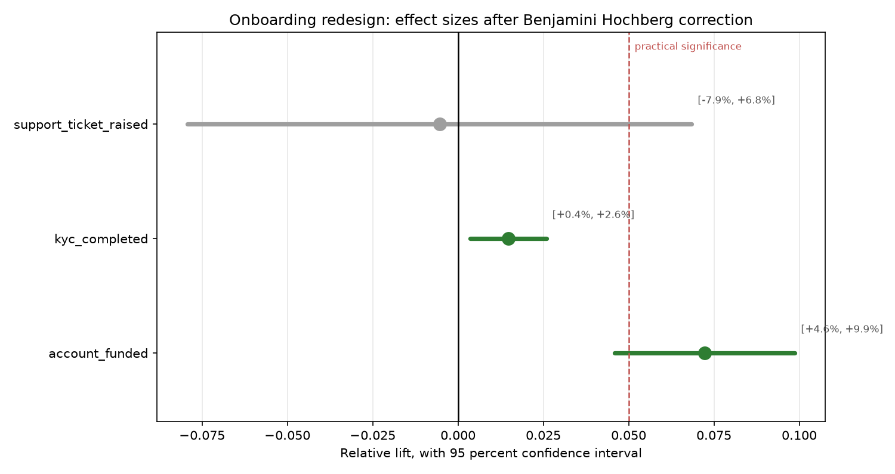

# A/B Test Analysis and Experiment Design

An end to end experimentation case study covering the full lifecycle of an online
controlled experiment: design, power analysis, sanity checking, inference, multiple
testing correction, and a recommendation a product team could act on.

Most A/B testing portfolio projects run a t test on two columns and stop. The parts
that matter in practice are the parts either side of that test. Deciding how much
data you need before you collect any. Checking that the randomisation actually
worked. Correcting for having looked at more than one metric. Translating a p value
into a decision, and being honest about when a null result means "no effect" versus
"we could not have seen it". Those are the steps here.



## The two experiments

**Criteo incrementality test.** A real randomised experiment from a live advertising
platform. 13,979,592 users, an intentional 85 / 15 allocation, a 0.29 percent
conversion rate. Sector: advertising and e-commerce. Pulled from Hugging Face
(`criteo/criteo-uplift`) by script, no manual download.

**Fintech onboarding redesign.** Simulated, with a planted ground truth effect. This
exists because the design phase happens before the data does, and you cannot honestly
demonstrate a power analysis on a dataset whose sample size someone else fixed years
ago. It also lets us inject a sample ratio mismatch deliberately and confirm the check
catches it.

## The pipeline

| Stage | What happens | Module |
|---|---|---|
| Design | Set the MDE from business cost, compute sample size and runtime | `src/power.py` |
| Sanity | Chi square SRM test, overall and by segment, plus covariate balance | `src/srm.py` |
| Inference | Two proportion z test, Welch t test, bootstrap intervals | `src/stats_tests.py` |
| Correction | Benjamini Hochberg across the metric family | `src/corrections.py` |
| Decision | Ship, ship with caution, do not ship, extend | `src/decision.py` |

## Results

### Criteo incrementality test

| Metric | Control | Treatment | Relative lift |
|---|---|---|---|
| Conversion | 0.194% | 0.309% | **+59%** |
| Visit | 3.82% | 4.85% | **+27%** |

Both survive Benjamini Hochberg correction. SRM check passes against the intended
85 / 15 allocation. Verdict: **SHIP**.

**That +59 percent is not an error, and the reason matters.** This is an
incrementality test, not a UI experiment. Control users are actively *prevented*
from being targeted by advertising at all. The comparison is not "new creative versus
old creative", it is "advertising versus no advertising". A large relative effect is
exactly what you would expect, and a small one would be evidence the ad spend was
worthless.

The absolute lift is the number that should temper the excitement: 0.115 percentage
points. Both arms convert rarely. Whether one tenth of a percentage point justifies
the campaign depends on cost per impression and the value of a conversion, neither of
which is in the dataset. That is why the decision notebook translates the lift into
incremental conversions per year rather than stopping at the p value.

### Fintech onboarding redesign

| Metric | Control | Treatment | Result |
|---|---|---|---|
| Account funded (primary) | 21.98% | 23.57% | **+7.2%**, 95% CI [+1.5%, +13.0%] |
| KYC completed (secondary) | 60.7% | 61.6% | not significant after correction |
| Support tickets (guardrail) | 3.39% | 3.37% | unchanged |

Sample size computed in advance for a 6 percent MDE at 80 percent power. SRM check
passes. No guardrail breach.

Verdict: **SHIP WITH CAUTION**. The effect is significant and positive, but the lower
bound of the interval, +1.5 percent, sits below the 5 percent practical significance
threshold that product agreed before the test started. The pessimistic case is a lift
too small to have paid for itself.

We recommend shipping anyway, because this is a screen redesign with no ongoing
maintenance cost, and the threshold was set assuming a change requiring continued
engineering investment. That is a product judgement, made explicitly and recorded as
such, rather than a caveat buried under a significant p value.



## Running it

```bash
python -m venv .venv
.venv\Scripts\activate             # Windows
source .venv/bin/activate          # macOS / Linux
pip install -r requirements.txt

python scripts/download_dataset.py # pulls 311 MB from Hugging Face, once
python -m src.simulate

pytest tests/ -v
```

Then run the notebooks in order, 01 through 04.

## Data handling

The Criteo file is 311 MB compressed, roughly 3 GB in memory as a pandas frame.
`scripts/download_dataset.py` streams it in chunks, writes a Parquet copy, and
accumulates exact counts as it goes. Every statistical test here consumes those counts
rather than the frame, because a two proportion z test needs four integers, not
fourteen million rows. The notebooks run in seconds on a laptop.

Nothing under `data/` is committed. Figures are, because results should be visible
without cloning.

## Design decisions worth defending

**Why the SRM test is against the intended ratio, not against balance.** Criteo splits
85 / 15 on purpose, because withholding advertising from control users costs real
money, so the control arm is kept as small as the required power allows. A naive check
for a fifty fifty split fires immediately here with a p value near zero, and would
conclude the experiment is broken when it is working exactly as designed.
`tests/test_srm.py` locks that behaviour in, and a second test fails if anyone
reintroduces the balance assumption.

**Why the SRM threshold is 0.001 rather than 0.05.** A false alarm costs an afternoon
of investigation. A missed SRM costs a wrong shipping decision. The asymmetry justifies
being strict.

**Why Benjamini Hochberg and not Bonferroni.** Bonferroni controls the probability of
any false positive at all, which is right when a single false claim is catastrophic.
BH controls the expected proportion of false claims among those declared significant,
which is what a product team is actually managing. With a small metric family and one
metric that genuinely matters, Bonferroni spends power on secondaries we do not need
certainty about, and that power comes out of the primary. Notebook 03 runs all three
corrections side by side, so the choice is visible as a decision rather than a default.

**Why the decision framework separates "no effect" from "underpowered".** A null result
from a well powered test is evidence the effect is not there. A null result from an
underpowered test is evidence of nothing at all. They look identical in a p value and
mean completely different things. Collapsing them is the most common error in experiment
reporting, and `src/decision.py` refuses to.

**Why significance is not the shipping criterion.** At fourteen million users almost
anything real is significant, and the p value stops carrying information. The question
that survives at that scale is whether the effect is large enough to be worth having,
which is what the confidence interval and the practical significance threshold are for.

**Why the analysis is pre-registered.** Notebook 01 commits to the metrics, the alpha,
the power target and the correction method before any outcome column is read. Checking
a fixed horizon test repeatedly and stopping when it crosses significance inflates the
false positive rate to roughly thirty percent. If early stopping is genuinely needed,
the answer is a sequential design with alpha spending, not a fixed design looked at
often.

## Citation

Diemert, E., Betlei, A., Renaudin, C. and Amini, M. (2018) 'A Large Scale Benchmark for
Uplift Modeling', *Proceedings of the AdKDD and TargetAd Workshop, KDD*, London, 20
August. New York: ACM.

Dataset licensed CC BY-NC-SA 4.0.